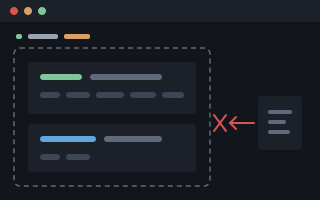
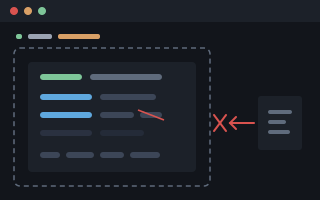

# Fettler &amp; Picker

**Bounded tools for a model and a script. The files go through `fettle`.
The SQL Server goes through `pick`. Two programs, two front ends each, and
no shell between them and the data.**

| `fettle`: the files | `pick`: the SQL Server |
|---|---|
| <a href="https://shoddymills.github.io/shoddy-fettler/fettle-reference.html#boundary"></a> | <a href="https://shoddymills.github.io/shoddy-fettler/pick-reference.html#gate"></a> |
| **Find, search, read and edit inside *declared trees*, and nothing else.** No current directory, no path that climbs out, no shell to get past it. Batches land all or not at all. Refused edits stop happening. | **SELECT and DESCRIBE inside *declared databases*, and nothing else.** No default database, no `USE`, no linked servers, no system catalog. Tables, views and columns are scoped one by one. One statement goes through a fail-closed parser gate. |
| A disclosure screen can refuse regulated data leaving a tree you name. | The same screen, over the rows coming out: same categories, same models, same `burler`. |
| [Docs](https://shoddymills.github.io/shoddy-fettler/) &middot; [Quick start](https://shoddymills.github.io/shoddy-fettler/fettle-quickstart.html) | [Docs](https://shoddymills.github.io/shoddy-fettler/pick.html) &middot; [Quick start](https://shoddymills.github.io/shoddy-fettler/pick-quickstart.html) &middot; [Reference](https://shoddymills.github.io/shoddy-fettler/pick-reference.html) |

An assistant given Fettler cannot wander. Every path it touches must sit
inside a *tree*, a folder you named ahead of time. Outside those trees
everything is refused: writing, reading, listing, even learning that a file
exists. There is no current directory to change, no path can climb out of a
tree, and there is no shell to get past it with. So it cannot wander into a
sibling project, an old copy, or your home directory, read the wrong thing,
and then answer from it with complete confidence.

**Nothing it does changes how _you_ work.** Your shell, your file explorer,
your editor and your git stay exactly as they were.

| | |
|---|---|
| **One file to install** | Self-contained and single-file, per OS. The target machine needs no .NET and no checkout. |
| **Two front ends, one program** | `fettle serve` speaks MCP to an assistant. `fettle read src/A.cs` answers a script. Same operations, same boundary. |
| **Every answer is the next call's argument** | `search` hands back `tree:path:line:column`. `read` numbers its lines and states a hash. `edit` asks for exactly those. Refused edits stop happening. |
| **It reads more than source** | Notebooks as cells, spreadsheets as rows with their formulas, Word as paragraphs under their headings, PDF as text per page, images as facts, and inside archives without unpacking them. |
| **Many calls become one** | `read` takes several paths. `search` takes several patterns. `batch` takes a whole sequence, applied all or not at all. |
| **A screen you can switch on** | Refuses to disclose regulated data out of a scope you name. If the screen cannot run, it refuses rather than serving the data unscreened. |

**[Read the docs](https://shoddymills.github.io/shoddy-fettler/)**
&nbsp;&middot;&nbsp;
[Quick start](https://shoddymills.github.io/shoddy-fettler/fettle-quickstart.html)
&nbsp;&middot;&nbsp;
[Installing it](https://shoddymills.github.io/shoddy-fettler/fettle-install.html)
&nbsp;&middot;&nbsp;
[In a project](https://shoddymills.github.io/shoddy-fettler/fettle-setup.html)

The project, the lane and the MCP server are **Fettler**. The thing a person
or a script types is **`fettle`**, the imperative, because
`fettle move a.txt b.txt` reads as an instruction and `fettler move` does
not. Both spellings are correct and neither is a typo.

The SQL twin follows the same arrangement. The project is **Picker** and the
command is **`pick`**. It is named for the rag pickers of the shoddy trade,
who picked and graded the stock by hand and altered none of it.

## The fettled workstation

<p align="center">
  <a href="https://shoddymills.github.io/shoddy-fettler/fettle-workstation.html">
    
  </a>
  <br>
  <a href="https://shoddymills.github.io/shoddy-fettler/media/disk-map.svg">&#x26F6; Full screen</a>
</p>

**The disk, and every way off it.** The hatched ground is the whole machine,
and it is the default. The lit blocks are the entire list, not a summary of
it. A repository can be opened at one folder and shut at the next. The files
that define the boundary are sealed inside the very tree that grants
everything else. The two exits open from one room only, because that is the
single place permitted to run anything at all. **Then there is Dropbox**, a
way off the machine that no task opens and nothing here can close. Sealing
that folder is not about privacy. It shuts a route that would bypass every
other line on the map.

<p align="center">
  <a href="https://shoddymills.github.io/shoddy-fettler/fettle-workstation.html">
    
  </a>
  <br>
  <a href="https://shoddymills.github.io/shoddy-fettler/media/workstation.svg">&#x26F6; Full screen</a>
</p>

**A workstation in fine fettle.** The client denies all eleven of its own
built-ins (the six file tools, the three shells, and the two output readers),
so the Fettler server is the only route to disk.
**One shell is easy to miss: `Monitor`.** It runs what it is handed in the
same environment `Bash` does, so denying `Bash` and leaving it open would
deny the word and not the thing.
**Two of the eleven are readers: `BashOutput` and `TaskOutput`.** They start
nothing and write nothing. But they hand back the output of work already
done, and those bytes reached the model without passing the tree boundary,
the secret scan or the disclosure screen.

**[Both diagrams full size, with the reasoning behind every line](https://shoddymills.github.io/shoddy-fettler/fettle-workstation.html)**

## The picked workstation

`fettle`'s map is a whole disk. `pick`'s world is one server, one declared
database, and one way in. There is less to draw than on the fettled
workstation, because SQL needs less: one database, one statement, no shell.

<p align="center">
  <a href="https://shoddymills.github.io/shoddy-fettler/pick-workstation.html">
    
  </a>
  <br>
  <a href="https://shoddymills.github.io/shoddy-fettler/media/pick-map.svg">&#x26F6; Full screen</a>
</p>

**The server, and the one way onto it.** The hatched ground is the whole
server, and it is the default. The lit database is the entire list, not a
summary of it. Inside the one lit database the scopes go on deciding: a
schema sealed, two columns that do not exist here, a view that answers its
columns and never its text. The system databases, the neighbours, the catalog
and the linked servers are not locked doors on the map. They are not on the
map at all, and asking for any of them answers in the same words as asking
for a table that never existed. The one way in carries statements, never
commands: one `SELECT` at a time, parsed whole, rewritten, and screened on
the way back.

<p align="center">
  <a href="https://shoddymills.github.io/shoddy-fettler/pick-workstation.html">
    
  </a>
  <br>
  <a href="https://shoddymills.github.io/shoddy-fettler/media/pick-workstation.svg">&#x26F6; Full screen</a>
</p>

**A workstation, picked.** The same three-boundary shape the fettled
workstation draws, with less in it because there is less to hold. The model
needs nothing new denied, because there is no built-in SQL tool, so wiring
`pick` adds one bounded route and closes nothing. The tool takes its boundary
from a governed file it re-reads before every call and refuses to write. The
server exists only as the declared databases, behind a login that could not
do more even if the gate failed.

**[Both diagrams full size, with the reasoning behind every line](https://shoddymills.github.io/shoddy-fettler/pick-workstation.html)**

## What is here

| Project | What it holds |
|---|---|
| `Fettler/Core` | the operations: containment, text, writes, glob, find, search, edit, file operations, tasks |
| `Fettler/Cli` | the command-line front end: verbs, exit codes, and both output modes |
| `Fettler/Mcp` | the MCP front end: stdio JSON-RPC, hand-rolled over `System.Text.Json` |
| `fettle` | the executable, and the whole of it is wiring |
| `burler` | the disclosure screen's model host, a **second** executable, for the reason below |
| `Picker` | the SQL boundary: verbs, grants, columns, the resolver, the ScriptDom query gate, both front ends |
| `pick` | a **third** executable. SELECT and DESCRIBE inside declared SQL Server databases, with its own MCP server |
| `Fettler.Tests` | the proof. Every item in R10 of the requirements is an assertion here |
| `burler.Tests` | burler's own proof, in its own project, so each side of the pipe asserts the wire independently |
| `Picker.Tests` | Picker's proof: the grant matrix and the whole query gate, pure against a catalog of literals |
| `docs/` | the published site, deployed to Pages from `main` |
| `scripts/` | the verifiers and the sitemap generator, all Node, all read-only bar one |
| `release-notes/` | one file per tag. The whole file becomes the release body |

## Building and working on it

**This repository is set up for Fettler, and builds itself with itself.**
`.fettler.json` declares one tree and the tasks below, so an assistant
working here reaches the build through `run` and never through a shell. That
is the tool's own argument applied to the tool. `run` executes only what the
configuration declares, never composes a command line, and needs the tree to
grant `execute`, which is never a default.

**None of that is required to build it.** Every task is a script in the root
of this repository, and a terminal is a first-class way in. The two routes
run the same file with the same arguments. There is no privileged path.

**This repository needs nothing built first.** Fettler references no project
outside its own tree, so there is no staged binary to publish and nothing to
weave. `scripts/fettler-build.ps1 test` is the whole suite and it runs in
minutes. There is no gate harness, no receipt store, and no `--resume`,
because there is nothing long enough to be worth resuming.

### From a terminal

```powershell
./scripts/fettler-build.ps1               # restore + build (Debug)
./scripts/fettler-build.ps1 test          # Fettler.Tests, burler.Tests AND Picker.Tests. All, always
./scripts/fettler-build.ps1 check         # the verifiers: twins, permissions, docs, errors
./scripts/fettler-build.ps1 release       # Release build
./scripts/fettler-build.ps1 publish 1.0.0 # self-contained single-file per OS, per program
./scripts/fettler-install.ps1             # install over the fettle on PATH
./scripts/fettler-install.ps1 -Stop       # ...and end the servers still on the old build
```

`fettler-install.ps1` is the one that closes the loop on a change. It
publishes a self-contained `fettle` for this machine and puts it over
whichever one is already on `PATH`.

**A running copy does not stop it.** It never overwrites the file in place.
Windows moves the old one aside and copies into the name it vacates. Unix
renames the new one onto the old. So the write always succeeds and nothing
has to be killed to make room for it. What a running copy *does* mean is
that it goes on serving the old build until restarted, because a process
does not reload its own image. So `-Stop` is about effect, not about writing.
Without it you are told which pids are still on the old build. With it they
are ended, and only ever **after** the new file is in place and has answered
`--version`, so a failed build cannot leave you with nothing that works.

**It is not a declared task, deliberately.** Run through `fettle run` with
`-Stop` it would be a child of the very server it is ending, so the kill
would take the task with it before it could report. It refuses when it sees
that. It cannot restart an MCP server either, and does not pretend to. A
stdio server belongs to the client that launched it, so install, then
reconnect from the client.

The git workflow is scripted too, end to end apart from the merge:

```powershell
./scripts/fettler-branch.ps1 feature NAME              # cut a branch off an up-to-date main
./scripts/fettler-checkin.ps1 -Message "what changed"  # stage and commit; pushes nothing
./scripts/fettler-pr.ps1                               # push and open a pull request
                                               #   <- a person merges it on GitHub
./scripts/fettler-branch.ps1 land                      # return to main, delete the branch
./scripts/fettler-ship.ps1 1.0.0                       # tag and push. CI publishes
```

Every script has a `.sh` twin taking the same arguments, flags included. The
twins verifier fails the build if the two drift apart.
**On Windows run the `.ps1`.** It is the half that ships there, and the twin
that goes unexercised is the twin that rots.

[WORKFLOW.md](WORKFLOW.md) is that sequence in full.

### From an assistant, or any MCP client

The same commands, as declared tasks. From a terminal:

```powershell
fettle tasks              # what is declared, and what each would launch
fettle run test           # run one
```

From an MCP client the tools are `tasks` and `run`, taking the same names.
**A task takes no arguments from its caller.** Name and timeout are the only
inputs, and anything else is refused rather than ignored. A variant is a
second declared task, or a value the configuration declares in braces.

| Task | Runs | Mutates |
|---|---|---|
| `build` | `scripts/fettler-build.ps1 build` | build output |
| `test` | `scripts/fettler-build.ps1 test` | build output |
| `check` | `scripts/fettler-build.ps1 check` | stages an executable bit, if one is wrong |
| `build-release` | `scripts/fettler-build.ps1 release` | build output |
| `publish` | `scripts/fettler-build.ps1 publish {release-version}` | build output |
| `verify-twins` | `scripts/fettler-verify-twins.js` | nothing |
| `verify-permissions` | `scripts/fettler-verify-permissions.js` | stages an executable bit |
| `verify-docs` | `scripts/fettler-verify-docs.js` | nothing |
| `verify-errors` | `scripts/fettler-verify-errors.js` | nothing |
| `survey-readability` | `scripts/fettler-survey-readability.js` | nothing |
| `sitemap` | `scripts/fettler-make-sitemap.ps1` | `docs/sitemap.xml` |
| `feature` | `scripts/fettler-branch.ps1 feature {feature-branch}` | a local branch |
| `bug` | `scripts/fettler-branch.ps1 bug {bug-branch}` | a local branch |
| `sync` | `scripts/fettler-branch.ps1 sync` | your branch |
| `checkin` | `scripts/fettler-checkin.ps1 -Message {checkin-note}` | **history**, locally |
| `pr` | `scripts/fettler-pr.ps1` | **origin**, and opens a pull request |
| `pr-draft` | `scripts/fettler-pr.ps1 -Draft` | as above, as a draft |
| `land` | `scripts/fettler-branch.ps1 land -Yes` | **deletes** a merged branch |
| `ship` | `scripts/fettler-ship.ps1 {release-version} -Yes` | **publishes** a release |

**No task is named with a bare git word.** The committing task is `checkin`,
not `commit`, and every script carries the `fettler-` prefix, so an
assistant's permission layer never mistakes a declared task for the raw git
command it resembles.

The braced names are **replacements**: values the configuration supplies, so
a branch name or a version never has to be composed into a command line by
whoever is calling. They live in `.fettler.local.json`, which is gitignored,
so today's branch name stays out of the diff. An undeclared name is refused
and the configuration does not load. That is why the file is required here
rather than optional.

**The last five write something you cannot take back.** They are declared
because the whole procedure is meant to be reachable, not because they should
be run casually. `land` under `-Yes` refuses a branch it cannot confirm was
merged, and `ship` refuses on anything but a clean `main` whose CI is green.

## Where the rest of it is written down

This file is the shop window. **The documentation is the site**, and that is
the only place any of it is maintained. Nothing is repeated here, so nothing
here can drift out of step with it.

| You want | Page |
|---|---|
| Installed and turned on, in about five minutes | [Quick start](https://shoddymills.github.io/shoddy-fettler/fettle-quickstart.html) |
| What the boundary looks like on a disk, drawn | [The workstation](https://shoddymills.github.io/shoddy-fettler/fettle-workstation.html) |
| Per-machine wiring and client registrations | [Install](https://shoddymills.github.io/shoddy-fettler/fettle-install.html) |
| Declaring trees, scopes and tasks | [In a project](https://shoddymills.github.io/shoddy-fettler/fettle-setup.html) |
| Refusing to disclose regulated data | [Screening](https://shoddymills.github.io/shoddy-fettler/fettle-screening.html) |
| The models the clinical, legal and scientific tiers need | [The models](https://shoddymills.github.io/shoddy-fettler/fettle-models.html) |
| SELECT and DESCRIBE inside declared SQL Server databases | [Pick](https://shoddymills.github.io/shoddy-fettler/pick.html) |
| pick's boundary, drawn on the same workstation | [Pick: the workstation](https://shoddymills.github.io/shoddy-fettler/pick-workstation.html) |
| A first bounded SELECT, in about five minutes | [Pick: quick start](https://shoddymills.github.io/shoddy-fettler/pick-quickstart.html) |
| pick's per-machine wiring, and burler beside it | [Pick: install](https://shoddymills.github.io/shoddy-fettler/pick-install.html) |
| Declaring servers, databases, scopes and columns for `pick` | [Pick, in a project](https://shoddymills.github.io/shoddy-fettler/pick-setup.html) |
| Refusing to disclose regulated rows | [Pick: screening](https://shoddymills.github.io/shoddy-fettler/pick-screening.html) |
| pick's models, chosen and licensed | [Pick: the models](https://shoddymills.github.io/shoddy-fettler/pick-models.html) |
| The query gate refusal by refusal, DESCRIBE's rules, pick's exit codes | [Pick: the reference](https://shoddymills.github.io/shoddy-fettler/pick-reference.html) |
| The boundary in full, every verb, every refusal, every exit code, the threat model | [Reference](https://shoddymills.github.io/shoddy-fettler/fettle-reference.html) |
| Why any of it is shaped the way it is | the source. The reasoning sits beside the code it explains |

## Contributing

[CONTRIBUTING.md](CONTRIBUTING.md) carries the invariants that must not be
quietly relaxed: no `ProjectReference` leaving this repository, a
`PackageReference` only from the allowlist, `Fettler.Core` naming no protocol
and no exit code, and the version living in the git tag rather than in a
file. [RELEASING.md](RELEASING.md) is the release path. [WORKFLOW.md](WORKFLOW.md)
is the sequence.

## Licence

MIT, &copy; 2026 Stephen Vincent Foster. `fettle` bundles PdfPig
(Apache-2.0). `pick` bundles Microsoft's ScriptDom parser and SqlClient
driver (both MIT). Every archive carries `NOTICE` and `LICENSE`, and
[THIRD-PARTY-NOTICES.md](THIRD-PARTY-NOTICES.md) is the full statement.
